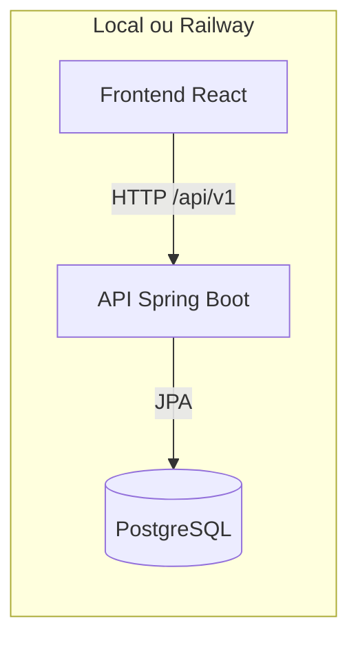

# ☁️ Do Zero à Cloud

> **Construa uma API Kanban com Spring Boot e publique tudo no Railway.**


## O workshop

Este workshop acontece em dois momentos:

| Semana | Objetivo | Resultado |
| --- | --- | --- |
| 1. Funciona localmente | Implementar a API e conectar o frontend ao PostgreSQL local. | Frontend → API → PostgreSQL no seu computador |
| 2. Funciona na cloud | Empacotar os serviços com Docker e publicar no Railway. | Frontend, API e banco acessíveis pela internet |



## Comece por aqui

### 1. Faça seu fork e clone

Cada grupo deve trabalhar no próprio fork. É esse repositório que será conectado ao Railway na segunda semana.

### 2. Crie o banco local

Com o PostgreSQL instalado e em execução, crie o banco usado pela API:

```bash
psql -U postgres -c "CREATE DATABASE kanban;"
```

A configuração padrão usa `postgres/postgres` e `localhost:5432`. Se necessário, altere `DB_URL`, `DB_USERNAME` e `DB_PASSWORD`.

### 3. Suba o backend

Em um terminal:

```bash
cd backend
./mvnw spring-boot:run
```

A API ficará disponível em `http://localhost:8090/api/v1`. O Hibernate cria as tabelas automaticamente no banco vazio.

### 4. Suba o frontend apontando para a API local

Em outro terminal:

```bash
cd frontend
npm install
npm run dev
```

Abra `http://localhost:5173`.

### 5. Siga os checkpoints

No frontend, acesse **Configurações → Auditoria da API**. A tela prepara dados temporários, mostra cada requisição e libera o próximo checkpoint somente depois da aprovação do anterior.

| Checkpoint | O que implementar | Conceitos |
| --- | --- | --- |
| 1. Board | `GET /board` no controller | rota, resposta JSON e service |
| 2. Column | controller e service para criar/listar colunas | path variable, regra de negócio e repository |
| 3. Task | mapeamentos, entidade, repository, service e controller | JPA, persistência e fluxo vertical completo |

As resoluções comentadas para copiar e colar estão em [`docs/resolucao-todos.md`](docs/resolucao-todos.md).

### 6. Prática local com containers

Depois de concluir os checkpoints, siga o [exercício de containers com Podman no WSL](docs/exercicio-containers.md). O Podman e o Compose são instalados pelo terminal do Ubuntu. Como os forks foram criados antes do `compose.yaml`, o roteiro também mostra como baixá-lo do repositório original para a raiz do fork. Em seguida, inicie PostgreSQL, backend e frontend separadamente e experimente logs, reinícios e persistência.

O caminho de cada funcionalidade é sempre:

```text
Frontend → Controller → Service → Repository → PostgreSQL
```

## Frontend com uma API publicada

Quando o backend já estiver publicado, rode o frontend local apontando para a URL pública:

```bash
cd frontend
VITE_API_URL=https://SEU-BACKEND.up.railway.app npm run dev
```

Informe apenas a origem da API, sem `/api/v1`.

## Semana 2 — Railway

1. Crie uma conta no [Railway](https://railway.com/) e conecte sua conta do GitHub.
2. Crie um projeto no Railway.
3. Adicione um serviço **PostgreSQL** ao projeto. Abra as variáveis do banco, copie o valor de `PGPASSWORD` e guarde-o para configurar o backend.

### Backend

1. Adicione um serviço a partir do seu repositório GitHub.
2. Selecione o repositório deste projeto.
3. Configure **Root Directory** como `/backend`.
4. Adicione as variáveis:

```text
DB_URL=jdbc:postgresql://postgres.railway.internal:5432/railway
DB_USERNAME=postgres
DB_PASSWORD=<valor de PGPASSWORD copiado do PostgreSQL>
PORT=8090
```

5. Gere um domínio público para o serviço, configure a porta de destino como `8090` e copie o domínio gerado.

O health check usa `/actuator/health`.

### Frontend

1. Adicione outro serviço a partir do mesmo repositório GitHub.
2. Selecione o mesmo repositório deste projeto.
3. Configure **Root Directory** como `/frontend`.
4. Adicione as variáveis:

```text
PORT=3000
VITE_API_URL=https://<domínio público copiado do backend>
```

Substitua o exemplo pelo domínio copiado, sem adicionar `/api/v1` ao final. Gere também o domínio público do frontend para acessar a aplicação.

O container lê `VITE_API_URL` quando inicia. Assim, a URL do backend pode mudar sem gerar uma nova imagem do frontend.

## Estrutura

```text
.
├── backend/     # API Spring Boot e exercícios
├── frontend/    # Interface React e auditoria guiada
├── docs/        # resolução dos TODOs e prática com containers
├── compose.yaml # serviços locais para Podman Compose
└── README.md    # guia principal do workshop
```

## Tecnologias

Java 17 · Spring Boot · Spring Data JPA · PostgreSQL · React · TypeScript · Docker · Railway
